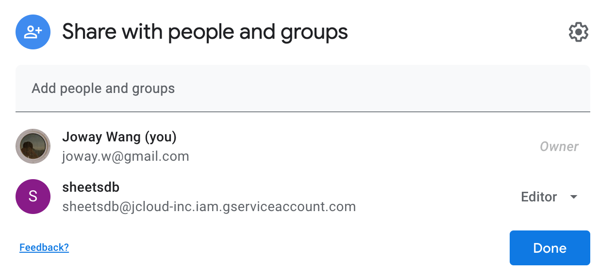

# SheetSQL


[](https://www.npmjs.com/package/sheetsql)
[](https://circleci.com/gh/joway/sheetsql)

Google Spreadsheet as a Database.

## Purpose

In the past, I often asked by non-technical colleagues to do some DB scripts jobs to mapping their spreadsheets data to the production database. And when their data changes the same work needs to be done again. Since these data are not changed too frequently(compared with other online data), it's also not worth to make a content management system for them.

But why don't make their spreadsheets as a real production database?  That's what ["Single source of truth"](https://en.wikipedia.org/wiki/Single_source_of_truth) means. What's more, you even could write back some statistical data like "Page View" to the spreadsheets, so they could see the feedback clearly and continue to optimize the content.

## Requirements

1. Create a Google Spreadsheet and populate the first row with the columns names, here is an [Example Sheet](https://docs.google.com/spreadsheets/d/1ya2Tl2ev9M80xYwspv7FJaoWq0oVOMBk3VF0f0MXv2s/edit?usp=sharing).
2. Create a [Google Cloud Service Account](https://cloud.google.com/docs/authentication/production) and download the JSON file that contains your key.
3. Find your service account email in [credentials console](https://console.cloud.google.com/apis/credentials) which similar with `account-name@project-name.iam.gserviceaccount.com`. 
4. Share your sheets to the above email, and make sure you have assigned it as an editor.



## Usage

### Concepts

#### db

`db` means the Google Spreadsheet ID. You can find it in your sheet's URL: `https://docs.google.com/spreadsheets/d/${YOUR_SHEETS_ID}/edit`

#### table

`table` means the Sheet Name in your Spreadsheet. The default is `Sheet1`.

#### data type

Every data in sheetsql will be set/get as a string. You need to handle the type mapping on your side.

#### keyFile

Your service account JSON key file.

### Install

```
npm i sheetsql -S
```

### Example

```typescript
const db = new Database({
  db: '1ya2Tl2ev9M80xYwspv7FJaoWq0oVOMBk3VF0f0MXv2s',
  table: 'Sheet1', // optional, default = Sheet1
  keyFile: './google-serviceaccount.json',
  cacheTimeoutMs: 5000, // optional, default = 5000
})

// load schema and data from google spreadsheet
await db.load()

// insert multiple documents
let docs = await db.insert([
  {
    name: 'joway',
    age: 18,
  },
])

// find documents and update them
docs = await db.update(
  {
    name: 'joway',
  },
  {
    age: 100,
  },
)

// find documents
docs = await db.find({
  name: 'joway',
})

// find all documents
docs = await db.find({})

// find documents and remove them
docs = await db.remove({
  name: 'joway',
})
```

### Using a Proxy

sheetsql depend on `googleapis` lib in which you can set the following environment variables to proxy http/https requests:

- `HTTP_PROXY` / `http_proxy`
- `HTTPS_PROXY` / `https_proxy`

The two environment variables could let your all requests using the proxy. If that is not your expected behavior and you only need to proxy google APIs, set `NO_PROXY=*`.

Here is the [discuss](https://github.com/joway/sheetsql/issues/4).
